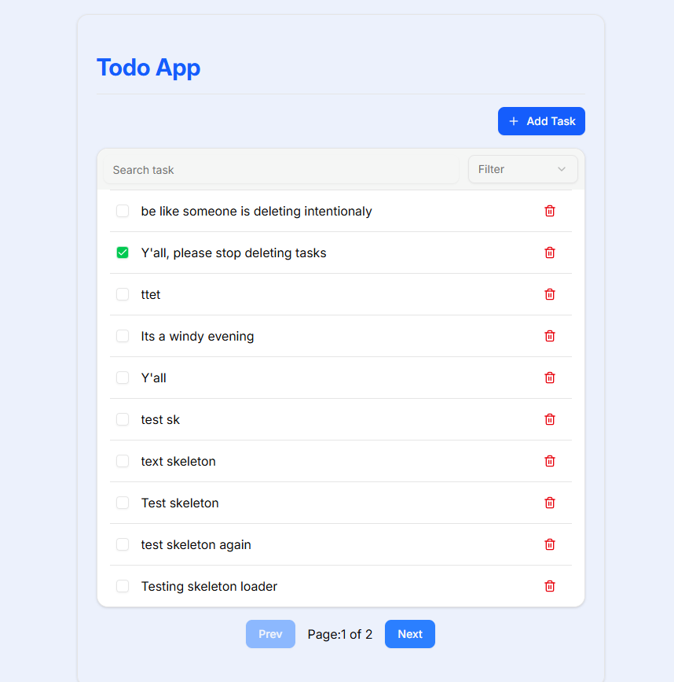
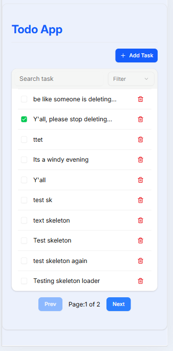
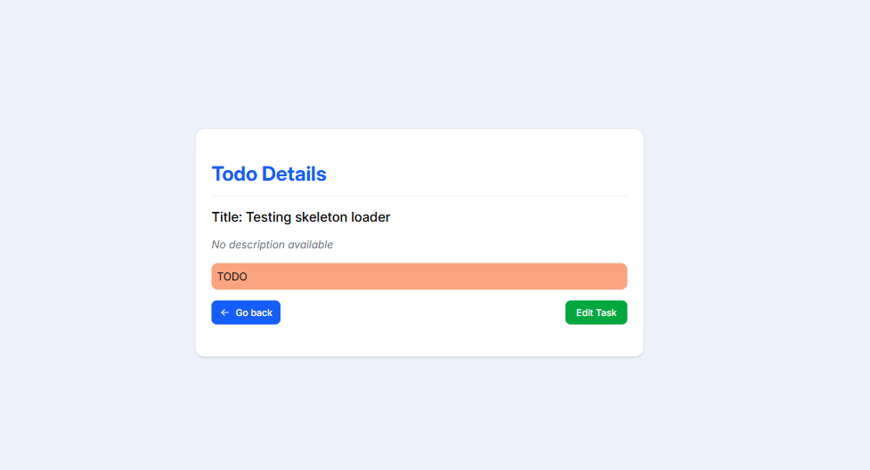
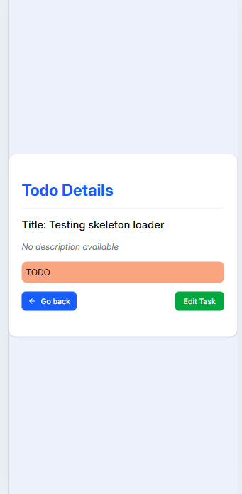
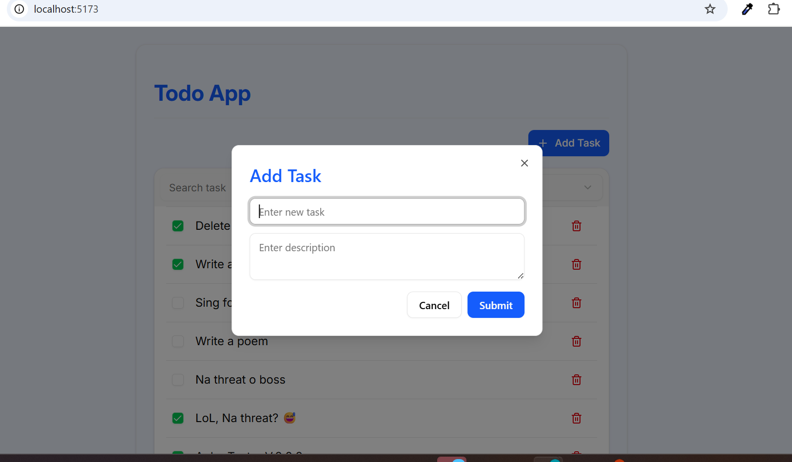

# 📝 Todo App 

### Project Description

**TodoApp** is a modern and accessible task management application buikd with **React 19**, **Tanstack Query**, and **Vite**. It allows user to create, view, update, delete, and filter todos with a sleek UI and smooth user experience.

## Screenshot
;

---

## 🔍 Project Overview

The app simulates real world scenarios with features such as client-side pagination, detailed task views, and persistent data caching using **localStorage**. It emphasizes accessibility, responsiveness, and error handling. 

This project was built as part of an assignment for AltSchool Africa showcasing both technical capability and attention to UX, accessibility and performance.

### Live Demo

🔗 [View Todo-App Live on Vercel](https://todo-app-dun-alpha.vercel.app/)

---

## 🚀 Features

- ✅ View paginated list of todos (10 per page)
- ✅ View detailed todo info via nested route
- ✅ Create, edit, and delete todos
- ✅ Filter todos by status: All / Completed / In Progress / Not Completed
- ✅ Search todos by title
- ✅ Error Boundary and 404 fallback
- ✅ Persistent cache using `localforage`
- ✅ Mobile friendly

---

## Tech Stack

- **React 19+**
- **React Router v7+**
- **TanStack Query** – data fetching and caching
- **ShadCN / Radix UI / Tailwind CSS** – UI components and styling
- **localforage** – persistent client-side storage
- **React Error Boundary** – error handling

---

## Project Structure

```bash
src/
│
├── assets/ # images
├── components/ # Shared components (TodoList, TodoDetail, Modal, etc.)
   ├── ui/ # ShadCN UI components
├── hooks/ # Custom React hooks
├── lib/ # Utility libs (e.g., queryClient, consumed API, API config)
├── pages/ # Page-level route components
├── App.jsx
└── main.jsx

```

> ### **NB:** The url path for the Error Boundary page is ***/test-error***	 and you can also check the 404 page with any url path (eg. todo-app/{add any path}).

---

## Setup Instruction

### 1. Clone the Repository

```bash
 git clone https://github.com/Ruqayah1204/todo-app.git

```

### 2. Install dependencies

```bash
npm install

```
### 3. Start development server

```bash
npm run dev

```

## Scripts & Command

| Command           | Description              |
| ----------------- | ------------------------ |
| `npm run dev`     | Run dev server           |
| `npm run build`   | Build app for production |
| `npm run preview` | Preview production build |

---

## API Usage

Tasks are fetched from :

- GET /todos – List todos (paginated)
+ GET /todos/:id – View single todo
- POST /todos – Create todo
+ PATCH /todos/:id – Edit todo
- DELETE /todos/:id – Delete todo


---

## 🧠 Architecture Decisions

- **TanStack Query** for cache management and async logic
- **localforage + persistQueryClient** to enable client-side persistence
- **ShadCN** for accessible and reusable UI components
- **Component-driven design** for scalability
- **Semantic HTML + ARIA** to meet accessibility standards

---

## 📸 Screenshots

| 🖥️ Desktop View                  | 📱 Mobile View                 |
| -------------------------------- | ------------------------------ |
|  |  |
|  |  |
|  |  


---

## 🌱 Future Improvements

- [x] Implement offline storage with Dexie.js and IndexedDB
- [x] Add user authentication
- [x] Dark mode toggle


---

## 👨🏽‍💻 Author

- **[Salaudeen Rukayat Temitope](https://github.com/Ruqayah1204)**


## 🙏 Acknowledgements

Special thanks to:

- **AltSchool Africa** – for providing a strong foundation in frontend development
- **[Mr. Oluwasetemi Ojo](https://github.com/Oluwasetemi)** – our supportive instructor for the Tinyuka Frontend track

---
